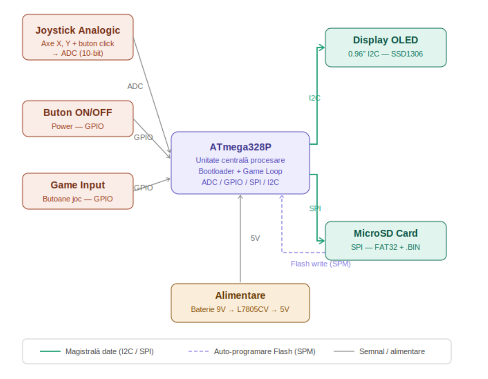
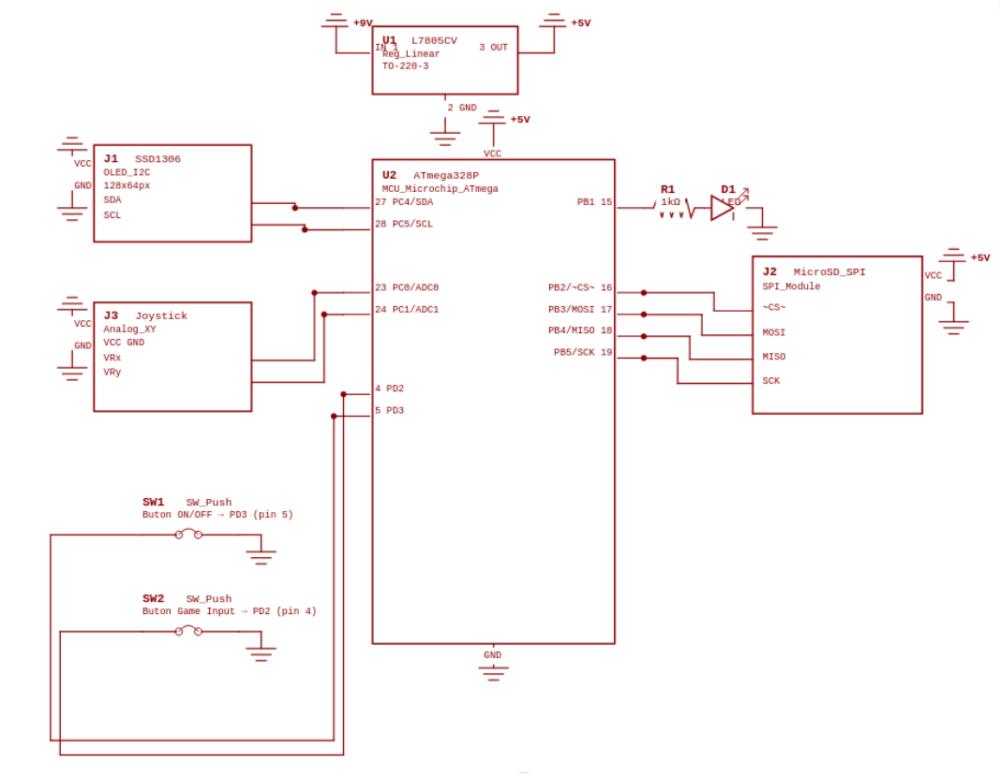
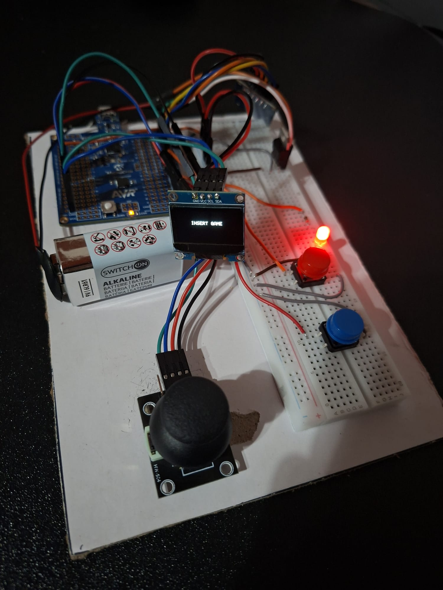

# 🎮 Retro Modular Console (GameBoy Clone)

> ATmega328P standalone · Custom SD Bootloader · OLED display · Snake & Tic-Tac-Toe

---

## Table of Contents

- [Introduction](#introduction)
- [General Description](#general-description)
- [Hardware Design](#hardware-design)
  - [Bill of Materials](#bill-of-materials)
  - [Pin Mapping](#pin-mapping)
  - [Schematic](#schematic)
- [Software Design](#software-design)
  - [Project Structure](#project-structure)
  - [Flash Memory Architecture](#flash-memory-architecture)
  - [Program Flow](#program-flow)
  - [Libraries & Optimizations](#libraries--optimizations)
- [Results](#results)
- [Conclusions](#conclusions)
- [Changelog](#changelog)
- [References](#references)

---

## Introduction

This project consists of building a retro game console (similar to the classic GameBoy), constructed *from scratch* on a breadboard around a **standalone ATmega328P** microcontroller.

**What it does:** The console runs classic games (Snake, Pong, etc.) that are not permanently stored in the processor's memory, but instead **dynamically loaded from MicroSD cards** — acting exactly like the physical cartridges of the '90s.

**Goal:** Overcoming the hardware limitations of the Harvard architecture (separation of data memory from program memory) on the ATmega328P, by implementing a **custom SD Bootloader** that enables in-place self-programming of the microcontroller.

**Why it matters:** The project demonstrates how the limitations of basic hardware can be overcome through clever software solutions. It is an excellent hands-on model for understanding how embedded systems work and how to efficiently manage limited resources.

---

## General Description

The system architecture is based on a minimal central processing unit, whose functionality is extended through input peripherals (buttons, joystick), output (display), and memory (SD card).

| Module | Interface | Role |
|---|---|---|
| ATmega328P | — | Central processing unit; executes the bootloader on every reset |
| MicroSD Module | SPI | Stores `.BIN` files; bootloader mounts FAT and flashes the game |
| OLED Display 0.96" | I2C (SDA/SCL) | Pixel-art graphics rendering; uses only 2 pins |
| Analog Joystick | ADC | Navigation; X/Y axes read as variable voltages |
| Push Buttons (×2) | GPIO (INT0/INT1) | Game Input and ON/OFF; internal pull-up, active LOW |
| L7805CV Regulator | — | Steps down 9V (battery) to clean 5V for the entire circuit |



---

## Hardware Design

The physical design was conceived to be as compact and stable as possible, using rigid wires on the breadboard to minimize cable clutter.

### Bill of Materials

- 1× **Microchip ATmega328P** microcontroller
- 1× **OLED 0.96" I2C** display (SSD1306/SH1106 driver)
- 1× **MicroSD Card reader** module (SPI interface)
- 1× **Analog Joystick** module (X, Y axes + integrated click button)
- 2× **Micro-switches** (push buttons — Game Input, ON/OFF)
- 1× **830-point Breadboard**
- Rigid and flexible jumper wires
- 1× 9V battery connector
- 1× **L7805CV** voltage regulator
- 1× Status LED
- 1× **1kΩ** resistor (LED current limiting)

### Pin Mapping

| Component | ATmega328P Pin | Signal | Reason |
|---|---|---|---|
| OLED SSD1306 | PC4 (pin 27) | I2C SDA | Dedicated hardware TWI pin |
| OLED SSD1306 | PC5 (pin 28) | I2C SCL | Dedicated hardware TWI pin |
| MicroSD Module | PB2 (pin 16) | SPI CS | Hardware SS pin of SPI controller |
| MicroSD Module | PB3 (pin 17) | SPI MOSI | Dedicated hardware SPI pin |
| MicroSD Module | PB4 (pin 18) | SPI MISO | Dedicated hardware SPI pin |
| MicroSD Module | PB5 (pin 19) | SPI SCK | Dedicated hardware SPI pin |
| Joystick | PC0 (pin 23) | ADC0 — X axis | Available ADC pin |
| Joystick | PC1 (pin 24) | ADC1 — Y axis | Available ADC pin |
| ON/OFF Button | PD3 (pin 5) | Digital input | Supports INT1 (external interrupt) |
| Game Input Button | PD2 (pin 4) | Digital input | Supports INT0 (external interrupt) |
| Status LED | PB1 (pin 15) | Digital output | Available GPIO pin |

> **Note:** Buttons require no external resistors — ATmega328P internal pull-ups are enabled in software. Active state is **LOW** (pressing connects the pin to GND). SPI and TWI pins are fixed by the MCU's internal hardware and cannot be reassigned.

### Schematic

The L7805CV regulator takes 9V from the battery and supplies stable 5V to the entire circuit. The ATmega328P communicates with the OLED via I2C (PC4/PC5), with the SD module via SPI (PB2–PB5), and reads the joystick via ADC (PC0/PC1). Buttons are wired directly to GND with internal pull-up enabled.



### Assembled Circuit

The OLED display shows the "INSERT GAME" message — the bootloader is running and waiting for a MicroSD card. The red LED indicates the console is active.



---

## Software Design

The software development is split into two main categories: the **System Bootloader** (memory management) and the **Game Engine** (actual firmware).

### Project Structure

```
.
├── boot/
│   ├── main.c        # SD logic + self-programming
│   └── flash.S       # SPM routines (Assembly)
├── drivers/
│   ├── spi.*         # SPI driver
│   ├── twi.*         # I2C/TWI driver
│   ├── adc.*         # ADC driver
│   ├── oled.*        # OLED SSD1306 driver
│   └── joystick.*    # Joystick driver
├── lib/
│   ├── pff.c         # Petit FatFS
│   ├── pff.h
│   └── integer.h     # Common data types
└── games/
    ├── snake/        # Snake firmware
    └── tictactoe/    # Tic-Tac-Toe firmware
```

### Flash Memory Architecture

The ATmega328P's 32KB Flash memory is split into two distinct sections, configured via **fuse bits** (`BOOTSZ=00`, `BOOTRST=0`):

```
┌─────────────────────────────────┐
│  0x7000 – 0x7FFF  (4KB)         │  ← Boot Section (Bootloader)
├─────────────────────────────────┤
│  0x0000 – 0x6FFF  (28KB)        │  ← Application Section (Current game)
└─────────────────────────────────┘
```

On every reset, the processor jumps directly to `0x7000`. The bootloader decides what runs next.

### Program Flow

**Bootloader (`0x7000`):**

```
Reset → 0x7000
  → Cold boot: wait for button press
  → Init TWI + OLED → display "INSERT GAME"
  → Loop:
      ├─ SD detected + FIRMWARE.BIN found → flash → jump to 0x0000
      ├─ ON/OFF button pressed → GPIOR0=0x5A → Sleep → wait for press → Awake
      └─ SD removed mid-game → GPIOR0=0xA5 → return directly to Awake
```

**Game — Snake / Tic-Tac-Toe (`0x0000`):**

```
0x0000 → Init peripherals → main loop:
  ├─ Read joystick → update game state
  ├─ Draw on OLED
  ├─ Check ON/OFF button → GPIOR0=0x5A → jump to 0x7000
  └─ Check SD every ~2s → if missing → GPIOR0=0xA5 → jump to 0x7000
```

### Libraries & Optimizations

**Libraries used:**

- **`flash.S`** (zevero/avr_boot) — the `SPM` instruction can only be executed from the Boot Section; verified Assembly implementation for the strict timing sequences required by the datasheet.
- **Petit FatFS** (ChaN) — the only FAT library that fits in 4KB, providing only the necessary operations (`mount`, `open`, `read`).
- **SPI/TWI/ADC drivers** — reused and adapted for ATmega328P, operating directly on hardware registers.

**Optimizations:**

- **`PROGMEM`** — constant data (OLED sequences, text bitmaps) stored in Flash instead of RAM, saving ~100 bytes out of the available 2KB.
- **Boot Section size constraint** — the entire bootloader logic (OLED driver, FAT, SPI, TWI) must fit within **4KB**, enforcing minimalist solutions: inline OLED driver, Petit FatFS with unused functions disabled, and polling instead of interrupts.

---

## Results

Full demonstration of the console in action:

1. The first game loaded is **Tic-Tac-Toe**.
2. The SD card is physically swapped for the **Snake** card — the bootloader automatically detects the new `FIRMWARE.BIN`, flashes the game, and boots it with no additional input, exactly like a physical cartridge.
3. During Snake gameplay, the ON/OFF button is pressed — the console shuts down completely (OLED and LED off). On the next press, the game resumes directly, skipping the bootloader screen.


---

## Conclusions

The project demonstrates that the hardware limitations of a basic MCU can be overcome through clever software solutions. The custom self-programming bootloader transforms a simple ATmega328P into a modular gaming platform, where each SD card acts as an independent physical cartridge.

---

## Changelog

| Week | Activity |
|---|---|
| **Week 1** | Hardware procurement. Pin planning. Basic assembly (power supply circuit on breadboard and ATmega328P functionality testing). |
| **Week 2** | Connection of all peripherals on the breadboard: OLED SSD1306 (I2C), MicroSD module (SPI), analog joystick (ADC), ON/OFF and Game Input buttons (GPIO), status LED. Individual component testing. Schematic design. Fully assembled and functional circuit. |
| **Week 3** | Complete software implementation: custom bootloader with self-programming, peripheral drivers (OLED, SD, ADC, SPI, I2C), Snake and Tic-Tac-Toe games. Full pipeline testing on hardware. Demo video recording. |

---

## References

- ATmega328P Datasheet — Microchip Technology
- OLED SSD1306 and MicroSD Card module documentation
- Course resources and labs from **Microprocessor Design** (I2C, SPI, ADC)
- [zevero/avr_boot](https://github.com/zevero/avr_boot) — SPM routines for AVR
- [Petit FatFS](http://elm-chan.org/fsw/ff/00index_p.html) — ChaN
